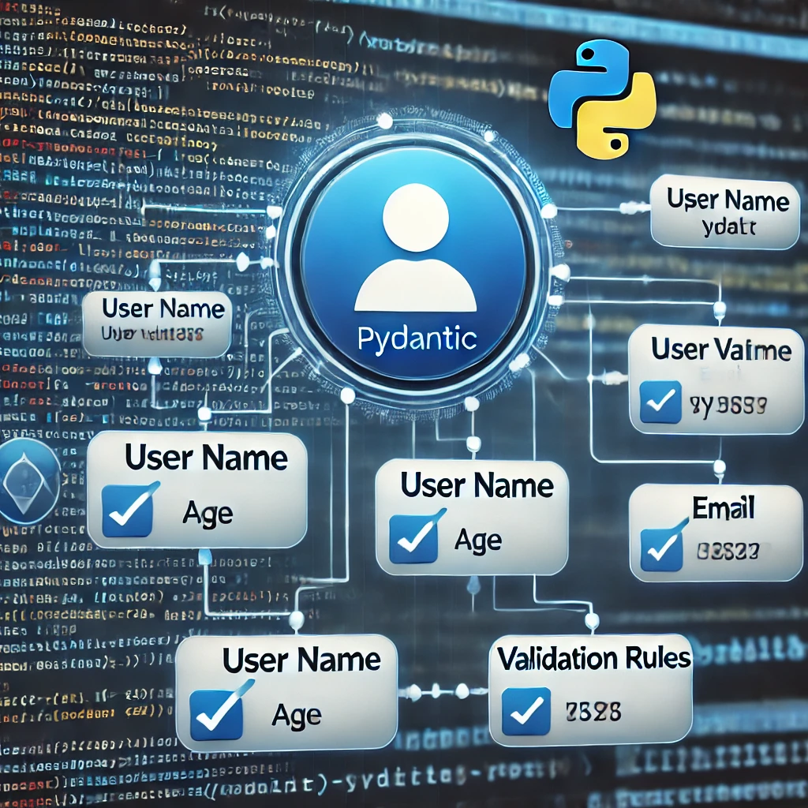

# 🤖 Understanding AI Agents: LangChain, CrewAI, and PydanticAI

## 📌 What is an AI Agent?
An **AI Agent** is a software system that can autonomously perform tasks, make decisions, and interact with data or users. These agents rely on various frameworks to enhance their capabilities. In this guide, we will explore three major AI Agent frameworks:

- **LangChain** 🔗 – For building AI-driven workflows.
- **CrewAI** 🤝 – For managing multiple AI agents.
- **PydanticAI** 🛠️ – For data validation and modeling.

---

## 🔗 How LangChain AI Works

LangChain simplifies the process of building AI-powered applications by providing tools to chain together different components, such as **language models, memory, APIs, and data sources**.

### 🛠️ Key Features:
- **LLM (Language Model) Integration** – Uses OpenAI, GPT, and other models.
- **Prompt Engineering** – Enhances AI responses with structured prompts.
- **Data Connectivity** – Integrates databases and APIs for real-time data processing.

    


### 🚀 Basic Example of LangChain:
```python
from langchain.llms import OpenAI
from langchain.chains import LLMChain
from langchain.prompts import PromptTemplate

prompt = PromptTemplate.from_template("What is {topic}?")
llm = OpenAI(model_name="text-davinci-003")
chain = LLMChain(llm=llm, prompt=prompt)

response = chain.run({"topic": "Artificial Intelligence"})
print(response)
```

### 🔍 Explanation:
- Defines an **AI-driven workflow** using LangChain.
- Uses **prompt engineering** to customize queries.
- Executes an AI **chain** to generate responses.

---

## 🤝 How CrewAI Works

CrewAI is designed for **multi-agent collaboration**, where different AI agents work together to complete tasks efficiently. Each agent has a specific role and performs predefined tasks.

### 🛠️ Key Features:
- **Multiple AI Agents** – Enables AI teamwork.
- **Task Assignments** – Agents handle specific responsibilities.
- **Sequential or Parallel Execution** – Tasks can be executed in order or simultaneously.

    


### 🚀 Basic Example of CrewAI:
```python
from crewai import Agent, Task, Crew

def main():
    agent1 = Agent(name="Data Collector", description="Collects data from various sources.")
    agent2 = Agent(name="Data Analyzer", description="Analyzes collected data.")
    
    task1 = Task(agent=agent1, description="Scrape data from API.")
    task2 = Task(agent=agent2, description="Perform sentiment analysis.")
    
    crew = Crew(agents=[agent1, agent2], tasks=[task1, task2])
    crew.run()

if __name__ == "__main__":
    main()
```

### 🔍 Explanation:
- **Defines agents** with specialized roles.
- **Assigns tasks** to agents.
- **Manages execution** using a Crew instance.

---

## 🛠️ How PydanticAI Works

PydanticAI focuses on **data validation and structured modeling**. It ensures that input data follows specific formats and rules, preventing errors in AI applications.

### 🛠️ Key Features:
- **Automatic Type Validation** – Detects incorrect data types.
- **Data Serialization** – Converts structured data formats.
- **Error Handling** – Prevents invalid input from breaking applications.

    


### 🚀 Basic Example of PydanticAI:
```python
from pydantic import BaseModel, ValidationError

class User(BaseModel):
    name: str
    age: int

try:
    user = User(name="Alice", age="twenty-five")  # This will raise an error
except ValidationError as e:
    print(e)
```

### 🔍 Explanation:
- **Defines a structured data model** using Pydantic.
- **Validates input types** automatically.
- **Catches errors** when data doesn’t match expected formats.

---

## 🎯 Choosing the Right AI Framework

| 🏗️ Framework | 🏆 Best For |
|-------------|-----------|
| 🔗 **LangChain** | Building AI-powered workflows and chatbots |
| 🤝 **CrewAI** | Managing multiple AI agents in a system |
| 🛠️ **Pydantic** | Ensuring data validation and structured modeling |

## 🔚 Final Thoughts
Each framework plays a crucial role in AI development:
- **LangChain** is ideal for AI-driven applications.
- **CrewAI** enables collaboration among multiple AI agents.
- **PydanticAI** ensures data quality and consistency.

By selecting the right framework, developers can build **more efficient, structured, and scalable AI systems**! 🚀